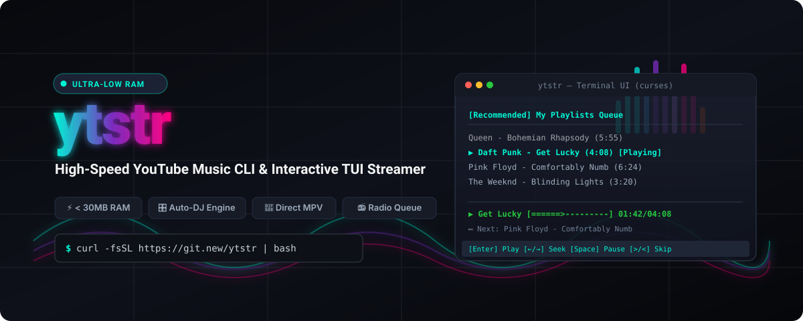

<div align="center">

<picture>
  <source media="(prefers-color-scheme: dark)" srcset="assets/banner.svg">
  <source media="(prefers-color-scheme: light)" srcset="assets/banner.svg">
  
</picture>

<br/><br/>

[](https://github.com/seeramsujay/ytstr/releases)
[](LICENSE)
[](https://python.org)
[](https://github.com/seeramsujay/ytstr#benchmarks)
[](https://mpv.io)
[](https://github.com/seeramsujay/ytstr#installation)

**A high-performance YouTube & YouTube Music audio streamer and automated DJ engine designed for weak desktops and power users alike.**

[Installation](#-installation) • [Key Features](#-key-features) • [Interactive TUI](#-interactive-tui) • [Keybindings](#-keybindings) • [Benchmarks](#-memory-benchmarks) • [Releases](https://github.com/seeramsujay/ytstr/releases)

</div>

---

## ✨ Overview

`ytstr` delivers an uncompromising audio experience right from the Linux terminal:
- **Ultra-Low Resource Footprint**: Engineered with strict memory boundaries (< 30 MB peak RAM) using direct MPV IPC streaming, zero unnecessary disk churn, and bounded sliding-window caches.
- **Interactive Curses TUI**: Effortlessly browse personalized YouTube Music feeds, library playlists, liked songs, live continuous radio queues, and search directly inside a rich terminal interface.
- **1-Click Browser Authentication**: Seamlessly authenticates with your active YouTube Music account from **Zen Browser**, **Firefox**, **Chrome**, **Brave**, **LibreWolf**, or **Edge**—no manual cookie exports or header pasting required.
- **Spectral Auto-DJ & Micro-Mixing**: An intelligent decision engine analyzing RMS, sub-bass (< 250 Hz), treble (> 2 kHz), and energy to execute 8 dynamic psychoacoustic transitions (Bass Swaps, Filter Washes, Tape Stops, Dynamic Rises, and Melts).

---

## ⚡ Installation

### 1. One-Line Script (Recommended)
Installs system dependencies check, builds the environment via `uv`, adds standalone binaries to `~/.local/bin/`, and automatically configures your shell `$PATH`:

```bash
curl -fsSL https://raw.githubusercontent.com/seeramsujay/ytstr/master/install.sh | bash
```

### 2. Standalone Binary (Zero Python Runtime Needed)
Download the single standalone ELF binary from the [Latest Release](https://github.com/seeramsujay/ytstr/releases):

```bash
curl -L -o ytstr https://github.com/seeramsujay/ytstr/releases/latest/download/ytstr
chmod +x ytstr
mv ytstr ~/.local/bin/
```

### 3. Build from Source
```bash
git clone https://github.com/seeramsujay/ytstr.git
cd ytstr
uv sync
./ytstr.py
```

To compile your own standalone single-file binary:
```bash
./build.sh
```

---

## 🔑 1-Click Browser Authentication

Connect your YouTube Music library and personal recommendations with a single command:

```bash
# Auto-detects session from Zen, Firefox, Chrome, Brave, Edge, etc.
ytstr --login

# Or target your browser profile directly:
ytstr --login zen
ytstr --login chrome
```

---

## 🖥️ Interactive TUI

Launch the full interactive terminal player:

```bash
ytstr
```

<div align="center">
  
</div>

### 🎛️ Keybindings

| Key | Action | Description |
| :---: | :--- | :--- |
| <kbd>1</kbd> – <kbd>6</kbd> / <kbd>Tab</kbd> | **Switch Tab** | Switch: Recommended, Playlists, Liked Songs, Radio Queue, Search, Account |
| <kbd>↑</kbd> / <kbd>↓</kbd> or <kbd>k</kbd> / <kbd>j</kbd> | **Navigate** | Move cursor up / down through track or playlist lists |
| <kbd>Enter</kbd> | **Play / Open** | Start track & spawn infinite radio / Drill into playlist |
| <kbd>Backspace</kbd> / <kbd>Esc</kbd> | **Back** | Exit playlist drilldown back to playlist list |
| <kbd>Shift</kbd> + <kbd>P</kbd> | **Play Playlist** | Queue and play entire selected playlist directly |
| <kbd>Space</kbd> | **Play / Pause** | Toggle playback pause / resume |
| <kbd>←</kbd> / <kbd>→</kbd> or <kbd>h</kbd> / <kbd>l</kbd> | **Seek (5s)** | Fast-forward or rewind current track by 5 seconds (MPV style) |
| <kbd>[</kbd> / <kbd>]</kbd> | **Seek (30s)** | Fast-forward or rewind current track by 30 seconds |
| <kbd>&gt;</kbd> or <kbd>.</kbd> / <kbd>n</kbd> | **Next Track** | Advance to next track in radio queue |
| <kbd>&lt;</kbd> or <kbd>,</kbd> / <kbd>p</kbd> | **Previous Track** | Skip back to previous track |
| <kbd>d</kbd> or <kbd>Delete</kbd> | **Discard Track** | Drop upcoming song from radio queue (or highlighted song in Queue tab) |
| <kbd>u</kbd> | **Queue View** | Jump directly to live Radio Queue tab |
| <kbd>9</kbd> / <kbd>0</kbd> or <kbd>-</kbd> / <kbd>+</kbd> | **Volume** | Step volume down / up by 5% |
| <kbd>/</kbd> | **Search** | Open instant search prompt across YouTube Music catalog |
| <kbd>r</kbd> | **Start Radio** | Force seed a brand new radio station from highlighted track |
| <kbd>m</kbd> | **Cycle Mode** | Switch between Direct Low-RAM → Light Mix → Stream → Auto-DJ |
| **Media Keys** | **Hardware Controls** | Top-row keyboard keys: Play/Pause, Next Track, Prev Track, Volume |
| <kbd>q</kbd> | **Quit** | Cleanly terminate playback and exit |

---

## 📊 Memory Benchmarks

All modes were audited with peak Resident Set Size (RSS) monitoring under continuous audio playback:

| Playback Mode | Previous Architecture | **ytstr v2.1.0 (Optimized)** | Efficiency Gain |
| :--- | :---: | :---: | :---: |
| **Direct No-Mix (`--no-mix`)** | 114.3 MB | **29.9 MB** | **-73.8% RAM** |
| **Direct Stream (`--stream`)** | N/A | **29.6 MB** | **Zero Disk Writes** |
| **Light Mix (`--light-mix`)** | 110.9 MB | **30.1 MB** | **-72.9% RAM** |
| **Spectral Auto-DJ** | 111.5 MB | **29.8 MB** | **-73.2% RAM** |

---

## 💻 CLI Usage

Prefer a command-line one-liner without launching the TUI? `ytstr` provides a fast CLI:

```bash
# Stream by search query in Direct Low-RAM mode (ideal for low-spec systems)
ytstr "synthwave chill mix" --no-mix

# Direct HTTPS stream with zero disk writes
ytstr "lofi hip hop radio" --stream

# Auto-DJ mode with psychoacoustic spectral transitions
ytstr "https://www.youtube.com/playlist?list=PL4fGSI1pDJn5kI81J1fYWK5eZRl1zJ5kM"

# Fast equal-power crossfade (Light Mix)
ytstr "cyberpunk 2077 ambient" --light-mix

# Save tracks file-by-file into ~/Music while playing
ytstr "chill hop essentials" --save ~/Music/ytstr

# List or manage saved playlist shortcuts
ytstr --list
ytstr --add "Focus Beats" "https://www.youtube.com/playlist?list=..."
ytstr --remove 1
```

---

## 🏗️ Architecture

```
ytstr/
├── src/ytstr/
│   ├── cli.py             # CLI parser and command router
│   ├── config.py          # Paths, defaults, and styling
│   ├── core/              # Player coordinator and playlist management
│   ├── dsp/               # Audio filters, equal-power curves, energy analysis
│   ├── downloader/        # yt-dlp wrapper and bounded cache manager
│   ├── engine/            # Spectral transition decision engine
│   ├── playback/          # Direct MPV IPC controller and DJ player
│   ├── ui/                # Curses TUI, input listener, and status rendering
│   └── ytm/               # 1-Click browser auth and YouTube Music API client
├── tests/                 # Comprehensive test suite (36 unit & integration tests)
├── assets/                # Visual assets and vector banners
├── install.sh             # Universal single-script installer
└── build.sh               # Standalone binary compiler (PyInstaller)
```

---

## 🤝 Contributing & License

Contributions, bug reports, and suggestions are welcome! Feel free to open an issue or pull request.

Distributed under the [GNU General Public License v3.0 or later](LICENSE).
